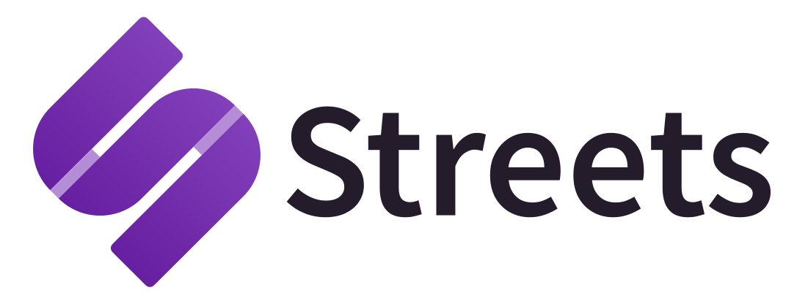

<div align="center">
  <a href="https://streets.eyemono.moe" target="_blank" rel="noopener noreferrer">
    <picture>
      <source srcset="src/assets/streets_logo_full_dark.min.svg" media="(prefers-color-scheme: dark)" />
      
    </picture>
  </a>
  <p align="center">
    Column-based nostr client for web
    <br />
    <a href="https://streets.eyemono.moe" target="_blank" rel="noopener noreferrer"><strong>Step into the Streets</strong></a>
    <br />
    <br />
    <a href="https://github.com/eyemono-moe/streets/issues/new?labels=bug&template=bug-report---.md">Report Bug</a>
    ·
    <a href="https://github.com/eyemono-moe/streets/issues/new?labels=enhancement&template=feature-request---.md">Request Feature</a>
  </p>
</div>


### Built With

[![TypeScript][typescript-image]][typescript-url]
[![SolidJS][solidjs-image]][solidjs-url]
[![Vite][vite-image]][vite-url]

## Development

🚧This code is still very much a work-in-progress. Major features are still missing.🚧

```bash
pnpm install

pnpm run dev # development

pnpm run build # production

pnpm storybook # v1 UI カタログ（ローカルリレー不要）

pnpm verify # 静的検査・型検査・単体テスト・本体と Storybook のビルド
```

### setup local relay and file server

```bash
docker compose up -d
```

This will start the following services:

- [nostr-rs-relay](https://github.com/scsibug/nostr-rs-relay): `ws://localhost:8080`
- [blossom-server](https://github.com/hzrd149/blossom-server): `http://localhost:8090`（画像のアップロード先 / NIP-B7）

画像のアップロード先だけを立てるなら `docker compose up -d blossom`。アプリ側は
設定 →「画像」で `http://localhost:8090` を足すと、ここへアップロードするようになります
（アップロードしたものは `GET http://localhost:8090/list/<自分の pubkey>` で一覧できます）。

### Sentry（壊れたときの報告）

`VITE_SENTRY_DSN` を渡してビルドすると、壊れたときに Sentry へ送ります。渡さなければ何も送らず、SDK も配りません（開発中も送りません）。

```bash
VITE_SENTRY_DSN=https://xxxx@o0.ingest.sentry.io/0 VITE_SENTRY_ENV=preview pnpm build
```

送る前に、鍵・公開鍵・イベント id を落とします（`packages/core/src/telemetry/scrub.ts`）。IP アドレスや Cookie は送りません。

### Contact

- eyemono.moe: <nostr:npub1m0n0eyetgrflxghneeckkv95ukrn0fdpzyysscy4vha3gm64739qxn23sk>

## Acknowledgments

- [rx-nostr](https://github.com/penpenpng/rx-nostr)
- [nostr-tools](https://github.com/nbd-wtf/nostr-tools)
- [rabbit](https://github.com/syusui-s/rabbit)
- [nostter](https://github.com/SnowCait/nostter)
- [nostr-zap](https://github.com/SamSamskies/nostr-zap)

[typescript-image]: https://img.shields.io/badge/TypeScript-007ACC?style=for-the-badge&logo=typescript&logoColor=white
[typescript-url]: https://www.typescriptlang.org/
[solidjs-image]: https://img.shields.io/badge/SolidJS-2c4f7c?style=for-the-badge&logo=solid&logoColor=white
[solidjs-url]: https://www.solidjs.com/
[vite-image]: https://img.shields.io/badge/Vite-646CFF?style=for-the-badge&logo=vite&logoColor=white
[vite-url]: https://vitejs.dev/
