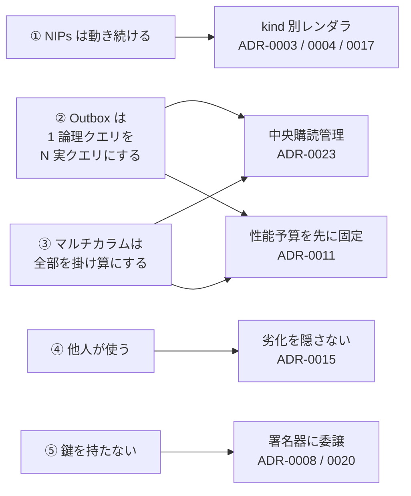
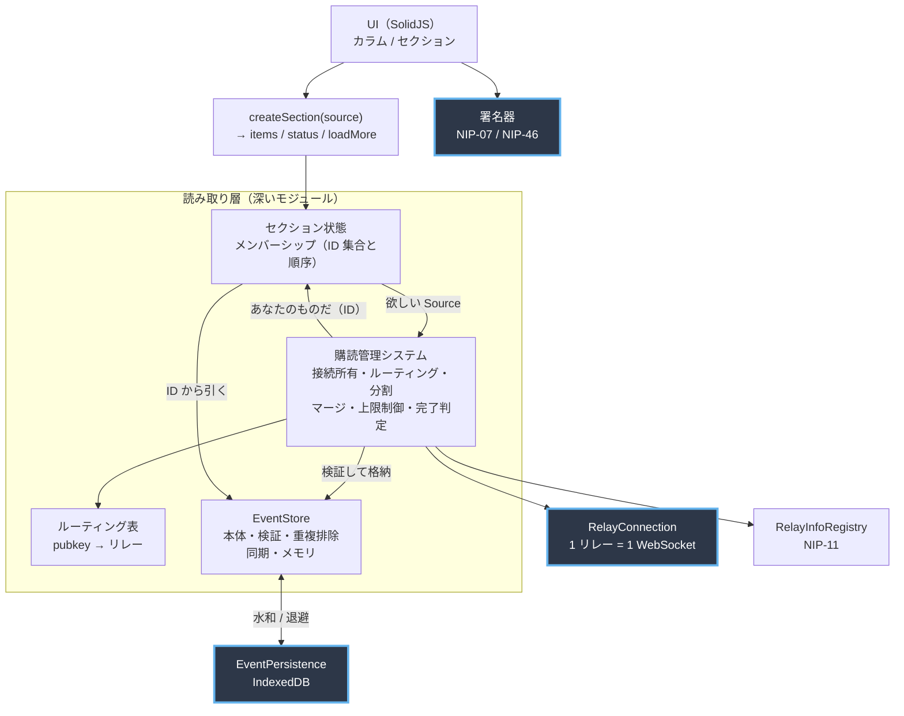
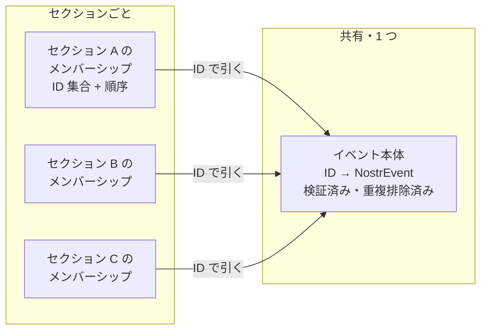
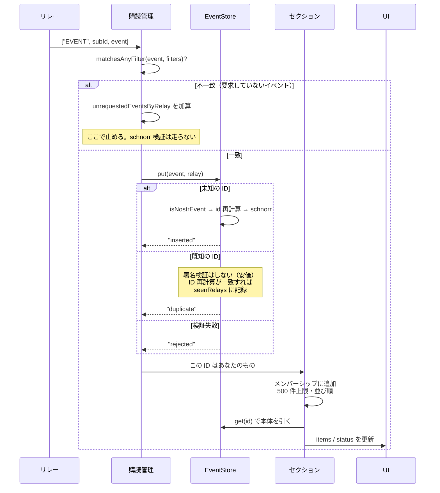
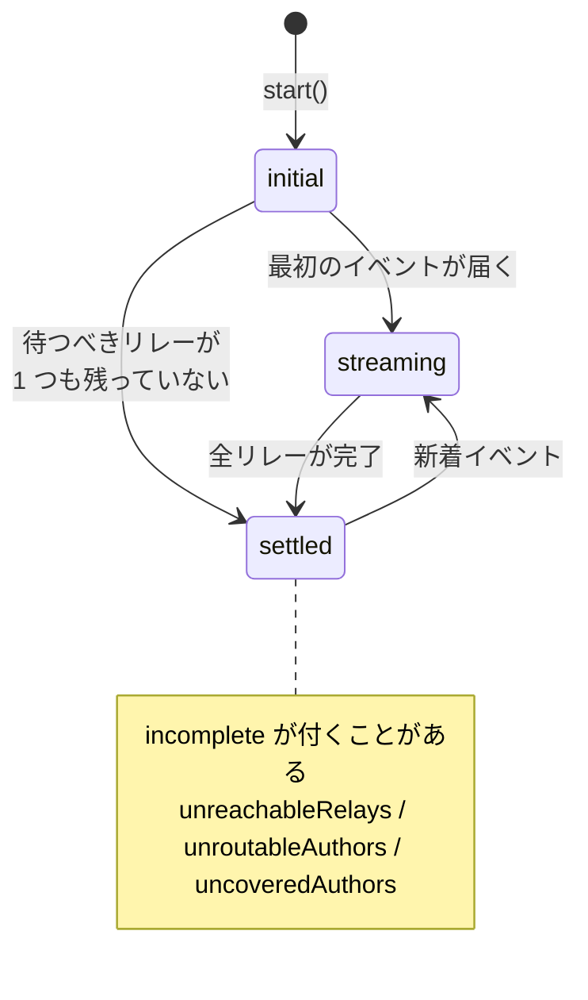

# streets v1 アーキテクチャ

**この文書は「なぜこの形なのか」を説明する。** 何がどこにあるかを知りたいだけならコードを読むほうが速い。ここにあるのは、コードを読んでも分からないこと — どんな力がこの構造を決めたか、何を意図的にやっていないか、どこを触ると何が壊れるか。

- 用語の定義は [CONTEXT.md](../../CONTEXT.md)
- 個々の決定と却下した代替案は [docs/adr/](../adr/)
- 実在するが直していない欠陥は [read-layer-followups.md](./read-layer-followups.md)
- 動作確認の手順は [verifying-v1-section.md](./verifying-v1-section.md)
- 次に作るものの設計は [docs/superpowers/specs/](../superpowers/specs/)

**現時点で実装されているのは読み取り層の 3 スライス目まで**（単一リレーのセクション読み取り、Outbox ルーティングと購読マネージャの器、接続プール）である。この文書は目標の構造を説明しているので、まだ存在しない部分がある。**どこが未実装かは 8 節に集約してある。**

---

## 1. この設計を決めている 5 つの力

アーキテクチャ上の判断のほぼ全部が、この 5 つのどれかから導かれている。**逆に言えば、この 5 つを知らずに構造を変えると必ず壊れる。**



### ① NIPs は動き続ける

Nostr では仕様そのものが頻繁に変わり、イベントの定義が変わる。カラム種別ごとに取得と表示を書くと、1 つの NIP 変更が複数のカラム実装に波及する。

→ **カラムは「イベントの配列」の開いた抽象とし、kind 固有の知識はレンダラ 1 箇所に閉じる**（[ADR-0003](../adr/0003-open-column-abstraction.md) / [ADR-0004](../adr/0004-kind-knowledge-lives-in-renderers.md)）。新しい kind への対応は「レンダラを 1 つ足す」で済む。

これは [NIP 追従パイプライン](../adr/0007-nip-tracking-pipeline-draft-pr-only.md)の前提でもある。変更範囲が機械的に特定できなければ、LLM が生成する差分はレビュー不能になる。

### ② Outbox は 1 論理クエリを N 実クエリにする

[ADR-0005](../adr/0005-outbox-model-from-v1.md) により、イベントは著者の write relay から取る。つまり「フォロー中 500 人の投稿」という 1 つの論理クエリは、**リレーごとに担当著者の異なる N 本の実クエリ**に分解される。

固定リレー方式なら「1 つのフィルタを全リレーへ同報」で済んだものが、**分割・合流・重複排除・リレー別ページネーション・完了判定**を必要とする。この複雑さは後から足せないので最初から入れた。

### ③ マルチカラムは全部を掛け算にする

カラム数 × Outbox のリレー数 × レンダラの関連イベント要求。**この 3 つが掛かる。**

だから [ADR-0011](../adr/0011-performance-budget.md) で性能予算を数値で先に固定した。予算を後から決めると「動くが重い」実装が既成事実化する。そして**同時接続 30 という上限を決めた時点で、購読管理の中央集権化が不可避になった**（[ADR-0023](../adr/0023-centralized-subscription-manager.md)）— 各カラムが自分で接続を開く形では、誰も全体を見ていないので上限を強制できない。

### ④ 他人が使う

[ADR-0001](../adr/0001-others-first-self-via-settings.md) により、作者の設定を知らない人が主要な想定利用者である。**壊れていることと、まだ実装されていないことと、劣化していることを、ユーザーが区別できなければならない。**

だから `status` は「読み込み中/完了」の 2 値ではなく、`incomplete` で**何が取れていないか**を伝える（[ADR-0015](../adr/0015-section-status-excludes-renderer-fetches.md)）。黙って欠落させることを禁じている。

### ⑤ 鍵を持たない

Nostr の鍵にはローテーションもリカバリもない。漏洩は回復不能である。

→ **秘密鍵はアプリに一度も入らない**（[ADR-0008](../adr/0008-signer-only-key-handling.md)）。署名も NIP-44 の復号も外部の署名器に委譲する。自前で書く暗号コードは存在せず、[ADR-0020](../adr/0020-no-nostr-library-noble-primitives-only.md) により監査済みプリミティブ（`@noble` / `@scure`）だけを借りる。

---

## 2. 全体像



青枠が **seam**（差し替え可能な接合部）。それ以外は読み取り層の内部であり、外から見えない。

**読み取り層が「深い」とはこの意味である** — 呼び出し側が学ぶのは `createSection(source)` が返す 3 つだけで、その裏にルーティング・分割・合流・重複排除・上限制御・完了判定が全部隠れている。

---

## 3. seam は 3 つだけ

**2 つ以上のアダプタが実在するものだけを seam とする。** 1 つしかないものは仮説上の seam であり、抽象のコストだけ払って何も得ない。

| Seam | アダプタ | なぜ差し替わるか |
|---|---|---|
| `RelayConnection` | WebSocket 実装 / fake | fake でルーティング・合流・完了判定を**ネットワーク無しで決定的にテスト**するため。`onClose(listener): () => void` で購読単位の `onClosed` とは別に**ソケットそのものの死**を通知する — 接続プール (8節) の再接続 (ADR-0021) はこれが無いと組めない |
| `EventPersistence` | IndexedDB / インメモリ | テストを IndexedDB 無しで走らせるため |
| 署名器 | NIP-07 / NIP-46 / fake | 秘密鍵を持たない以上、外部実装が複数存在することが前提 |

### `EventStore` は seam ではない

[ADR-0014](../adr/0014-thin-relay-connection-deep-read-layer.md) では seam としていたが、[ADR-0018](../adr/0018-indexeddb-event-cache.md) で取り消した。IndexedDB を `EventStore` の**差し替え**ではなく**背後の水和・退避層**にしたため、`EventStore` の実装はメモリ 1 つになったからである。

```
起動時   IndexedDB → メモリへ水和（非同期・1 回だけ）
読み取り メモリのみ（同期）
書き込み メモリへ同期 + IndexedDB へ非同期キュー
```

**読み取りを同期に保つためにこの形にした。** `EventStore.get(id)` が非同期になると、レンダラが本体を引くたびに await が発生し、描画が段階的になる。

---

## 4. 状態を誰が持つか — ここが設計の核心



**本体は共有し、メンバーシップはセクションが持つ**（[ADR-0024](../adr/0024-shared-bodies-per-section-membership.md)）。

### なぜ「store に対するクエリ」ではないのか

「大きな store を用意し、各カラムはその store に対するクエリである」という設計は自然に見えるが、**Nostr では成立しない。カラムのメンバーシップは store の純粋関数ではない。**

同じフィルタを持つ 2 つのカラムでも中身が違いうる。

- `limit: 500` で表示されるのは「store 内でマッチする全イベント」ではなく、**リレーが返すことを選んだ 500 件**
- 特定リレー内タイムラインは、フィルタが同じでも**取得先リレーが違えば中身が違う**（[ADR-0003](../adr/0003-open-column-abstraction.md) が明示的に要求している表示）
- ページネーション位置はカラムごとに独立

メンバーシップは `filter(store)` ではなく **`filter(store) ∩ この購読で実際に配信されたもの`** であり、**経路依存**である。

v1 の初期検討で TanStack DB を中核に据えて失敗したのはこれが理由である。**「store に対するリアクティブクエリでカラムを表現する」という案は、どのライブラリを使っても同じ理由で破れる。**

### 配信の向き

購読管理システムからセクションへ流れるのは「**あなたのメンバーシップにこの ID を足せ**」という通知であって、store がカラムの中身を決めるのではない。この向きを守ること。

---

## 5. 1 イベントが届いてから表示されるまで



**照合を通ったイベントについて、`"rejected"` 以外はセクションに渡る。** `"duplicate"` を弾くと、store を共有した 2 つ目以降のセクションが空になり、IndexedDB 水和後は全セクションが空になる。ただしセクションが並べるのは**リレーが送ってきたオブジェクトではなく store の検証済みコピー**である。既知の ID を再利用した偽造イベントを弾くのがこの一手である。

### 署名検証は偽造を止めるが混入を止めない

署名検証が保証するのは「この pubkey が確かにこの内容に署名した」ことだけで、「それが自分の要求したものか」は何も言わない。リレーは、フォローしていない人の正当なイベントや別 kind のイベントを、そのカラムへ押し込める。

[ADR-0005](../adr/0005-outbox-model-from-v1.md) の Outbox がこの面積を実質的に広げた。**セクションが話しかけるリレー集合を決めるのが、ユーザー自身ではなくフォローしている著者になった**ためである。フォロー相手の `kind:10002` が、こちらがどのリレーに繋ぐかを決めている。

**解消済み（2026-08-02）。** 図のとおり門を 1 つから 2 つに増やした —— **照合 → 検証**の順である。NIP-01 のフィルタ意味論（`since ≤ created_at ≤ until`、タグは共通要素が 1 つ以上、複数フィルタは OR）を自前で実装した `matchesFilter` / `matchesAnyFilter`（`src/core/read/filter-match.ts`、依存ゼロの純粋関数）が最初の門になる。**照合を検証より先に置くのは、照合の方が schnorr 検証より安いためである** —— 要求していないイベントの洪水を浴びても、払うコストは文字列比較であって暗号検証ではない。捨てた件数は `SubscriptionManager.unrequestedEventsByRelay`（リレーごと、単調増加）とブートストラップ側の `WarmUpResult.unrequested` に現れ、`/debug/v1-section` の `data-testid="unrequested"` / `"unrequested-relays"` から見える。[ADR-0023](../adr/0023-centralized-subscription-manager.md) は当初これを購読マージの帰結として記録していたが、**マージの有無に関係なく必要だった**（2026-08-01 訂正）。設計の詳細は [local-filter-matching 仕様](../superpowers/specs/2026-08-02-local-filter-matching-design.md)。

---

## 6. 「読み込み完了」の定義

**この定義が難しいのは、意味の違う 3 層が混ざるからである。**



| 層 | 「終わった」の意味 | 扱い |
|---|---|---|
| リレー単位 | EOSE が届いた | Outbox ではリレーごとに担当著者が違うので単体では意味を持たない |
| **セクション単位** | **待っている全リレーが完了** | **これが `phase`** |
| レンダラ単位 | 各アイテムの関連イベントが揃った | 遅延取得なので**永遠に確定しない**。`status` に含めない |

**3 層目を外したことで、セクションの完了は有限時間で決まるようになった**（[ADR-0015](../adr/0015-section-status-excludes-renderer-fetches.md)）。レンダラのローディングは本質的にアイテムごとの関心事であり、セクション全体に集約すべきものではなかった。

**問い合わせ先がゼロのセクションは `settled` である。** `relays: []` を明示的に持つソースは購読を 1 つも開かないが、空集合に対するクエリの結果は空であり、そのクエリは完了している。「どこも見ていない」のではなく「見るべき場所が存在せず、そこには何も無かった」が正しい記述であり、欠落しているものが無いのだから報告すべき劣化も無い。`relays` が**未指定**（Outbox に任せる）のとは意味が違う — 詳細は [ADR-0015](../adr/0015-section-status-excludes-renderer-fetches.md)。

### カラムごとのリレー指定でできること・できないこと

`Source.relays` は **Outbox ルーティングのバイパス**であって、候補リレーの絞り込みではない。機能要件「特定リレー内タイムラインカラム」（Should）はこれで満たせるが、次の形は**現時点では表現できない**。

| やりたいこと | 現設計 |
|---|---|
| このリレーだけ見る | できる |
| 既定の Outbox に**加えて**リレー X も見る | 排他なのでできない |
| **著者ルーティングは効かせたまま**候補リレーを絞る | できない |
| ブロックリレー（`kind:10006`）で候補を除外 | 未対応 |

3 行目は「フォロー中のタイムラインだが日本語圏のリレーからだけ」のような要求で効いてくる。現在の要件には無いため実装していない。必要になった時点で `relays` を「バイパス指定」から「候補集合の制約」へ広げる判断になる。

### マージしても完了は分かる

EOSE は購読単位であってフィルタ単位ではない（`01.md:157`）。だが**購読管理システムは自分でまとめたのだからグループの構成を知っている**。

```
リレーの完了     = そのリレー向けマージグループの EOSE が届いたとき
セクションの完了 = そのセクションが待っている全リレーが完了と記録されたとき
```

**失われるのは情報ではなく時間解像度だけ**である（速いセクションが遅いグループメイトを待つ）。その損失も、待たされているセクションをグループから切り出せば消せる（[ADR-0023](../adr/0023-centralized-subscription-manager.md)）。

---

## 7. 依存方針

Nostr の高水準ライブラリには依存しない（[ADR-0020](../adr/0020-no-nostr-library-noble-primitives-only.md)）。

| 依存 | 用途 |
|---|---|
| `@noble/curves` | schnorr 署名検証 |
| `@noble/hashes` | sha256（イベント ID の計算） |
| `@scure/base` | bech32（NIP-19） |

**暗号は一行も自作しない。** NIP-44 の暗号化・復号は署名器に委譲する。

ライブラリを外せたのは、[ADR-0014](../adr/0014-thin-relay-connection-deep-read-layer.md) で `RelayConnection` を 1 リレー専用に落とした結果、Nostr ライブラリの主要な価値（多リレー協調・プール・outbox 補助）が全部こちらの読み取り層に移ったからである。残るのは NIP-01 のメッセージ層約 150 行と暗号プリミティブだけになった。

**この制約は `pnpm check` で機械的に検査される**（`scripts/check-read-layer-deps.mjs`）。人間の記憶に頼らない。

---

## 8. 意図的にやっていないこと

**未実装と欠陥は違う。** ここにあるのは全部「まだやっていない」であり「壊れている」ではない。

| やっていないこと | 理由 | いつ |
|---|---|---|
| DM (NIP-17) | 中途半端な暗号化実装はユーザーを実害に晒す（[ADR-0006](../adr/0006-no-dm-in-v1.md)） | v1 では**やらない** |
| 外部画像のプロキシ | 帯域コストを個人が負担できない。既定は直読みで、リスクを告知し設定で回避可能（[ADR-0012](../adr/0012-external-images-loaded-directly-by-default.md)） | 既定は変えない |
| モバイルでのデッキ編集 | マルチカラム UI はモバイルで原理的に成立しない（[ADR-0009](../adr/0009-mobile-single-column-view-only-editing.md)） | **やらない** |
| カラムごとの別アカウント | 「署名対象」と「自分宛」が一意に決まらなくなる（[ADR-0010](../adr/0010-single-active-account.md)） | v1 では**やらない** |

### 接続プール — 実装済み

[接続プールの仕様](../superpowers/specs/2026-08-01-connection-pool-design.md)で設計し、`ConnectionPool`（`src/core/read/connection-pool.ts`）として実装が完了した。以前はここに「設計は決着済み、実装が未着手」として並んでいた 4 項目は次のとおりすべて入っている。

- **30 接続上限。** `ConnectionPool` が唯一の接続開設点になり（[ADR-0023](../adr/0023-centralized-subscription-manager.md)）、`MAX_CONNECTIONS = 30`（[ADR-0011](../adr/0011-performance-budget.md)）をルーティング済み・明示指定・fallback・ブートストラップの全経路で強制する。予算超過で開けなかったリレーは黙って消えず `incomplete.uncoveredAuthors` / `incomplete.unreachableRelays` として表面化する（[ADR-0015](../adr/0015-section-status-excludes-renderer-fetches.md)）。
- **リレーの選択。** 著者ごとに先頭 3 本を取って和集合にする方式から、`selectRelays`（`src/core/read/relay-selector.ts`、[ADR-0025](../adr/0025-greedy-relay-selection-under-a-global-budget.md)）による貪欲被覆選択へ置き換えた。ピン留めしたリレーを優先しつつ、残り予算を「まだ被覆していない著者数が多い順」に貪欲へ埋める。
- **生きているセクションの張り直し。** 公開 `replan()` を呼ぶと再計画され、フィルタが変わったリレーは `SectionDelivery.onRelayRestarted` でセクションへ通知する（[ADR-0016](../adr/0016-routing-bootstrap.md) が定める「解決後に張り直す」の後半）。接続自体は張り直さない（同一プール接続で close + subscribe）ので「開き直さない」保証は保たれる。**`kind:10002` の到着を引き金に自動で呼ぶ経路は無い** —— [ローカルフィルタ照合のスライス](../superpowers/specs/2026-08-02-local-filter-matching-design.md) 6 節がこの引き金を削除した。呼ぶのは水和や再ウォームアップなど明示的な入口のみ（[ADR-0016](../adr/0016-routing-bootstrap.md)）。
- **再接続・バックオフ。** `ConnectionPool` がソケットの自然死を `RelayConnection.onClose` で検知し、指数バックオフ（初回 1 秒・上限 60 秒）＋ジッタで再接続する。**永久に諦めない**（[ADR-0021](../adr/0021-reconnection-policy.md)、`accepted`）。切断中は `incomplete.unreachableRelays` に計上され続け、復帰すれば自然に減る。実ソケットが死んで実リレーが復帰することは `e2e/relay-recovery.spec.ts` でのみ確かめられる（10節）。

**死んだ接続がプールに残り続ける欠陥も解消済み。** `RelayConnection`（3節）に `onClose` を足し、プールが「ソケットの死」を検知して即座に予算とレジストリから外すようにした。

---

## 9. 未決定

- **メモリ側の破棄戦略。** [ADR-0019](../adr/0019-two-bucket-cache-policy.md) は永続層のバケットを決めたが、共有 `EventStore` から「誰も参照しなくなったイベント」を落とす仕組みは未定（[ADR-0024](../adr/0024-shared-bodies-per-section-membership.md) が持ち込んだ新しい要件）。
- **設定項目の追加に対する歯止め。** [ADR-0001](../adr/0001-others-first-self-via-settings.md) の「自分の使い方は設定で逃げる」を無制限に適用すると組み合わせ爆発を招く。
- **IndexedDB のスキーマ移行手順。**
- **既定リレーの API 化。** 現在はハードコード。ハードコードされたリストは腐る（[ADR-0022](../adr/0022-deploy-to-cloudflare-workers-static-assets.md) が Workers を選ぶ理由）。

---

## 10. テスト戦略

| 層 | 方法 | なぜそれで足りるか |
|---|---|---|
| レンダラ | `needs` / `render` を純粋関数として単体テスト | `related` を手で組み立てて呼ぶだけ。フック環境も Provider も不要 |
| 読み取り層 | fake `RelayConnection` で決定的にテスト | ルーティング分割・合流・完了判定・上限制御を**ネットワーク無しで**再現できる |
| 永続化 | インメモリ `EventPersistence` | IndexedDB 無しで走る |
| 相互運用 | ローカルリレー + Playwright | **実リレーのイベントが検証を通ることは、ここでしか確かめられない** |

**この分担には実績がある。** `RelayInfoRegistry` が `fetch` を unbound で保持していたバグは、ユニットテスト 16 件すべてを素通りした（モックがアロー関数で `this` を無視するため）。実ブラウザで初めて `TypeError: Illegal invocation` を投げ、e2e が捕まえた。**モックで通るものが実物で通るとは限らない。**

現時点で [ADR-0011](../adr/0011-performance-budget.md) の性能予算 7 指標のうち**測っているのは接続数の 1 つだけ**である。同 ADR は「測定できない予算は要件ではなく願望である」と定めているので、残る 6 指標は満たしていない要件である（[read-layer-followups.md](./read-layer-followups.md)）。

**接続数の予算は[接続プールのスライス](../superpowers/specs/2026-08-01-connection-pool-design.md)で 7 指標中最初に E2E で測れるようになった。** `e2e/connection-budget.spec.ts` が、架空のリレーを多数宣言する著者を seed し、開こうとしたリレーの高水位マークが予算以下に収まること・実在するリレーが選ばれること（＝貪欲被覆が効いていること）・落とした著者を `uncoveredAuthors` として報告することを主張する。加えて `e2e/relay-recovery.spec.ts` が、実ソケットが死んで実リレーが復帰することを確かめる — バックオフのユニットテストは偽タイマーで測っているため、実際の再接続が起きることはここでしか確かめられない（ローカルの `nostr-rs-relay-2` を `docker compose stop`/`start` する分、他の e2e より一桁遅く、専用の spec ファイルに分けてある）。
