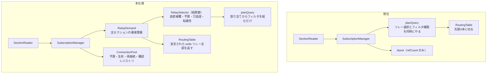

# 接続プール — どのソケットが存在するか

読み取り層の後続 #3 を 3 分割したうちの 1 枚目。**アプリ全体で開いているリレー接続の集合を、予算内で意図的に選び、生かし続ける**ところまでを担当する。

用語は [CONTEXT.md](../../../CONTEXT.md)、全体像は [architecture.md](../../design/architecture.md)、繰延事項は [read-layer-followups.md](../../design/read-layer-followups.md)。

## 0. なぜ 3 分割したか

「後続 #3」として各所に書かれていたものを集めると、独立した subsystem が 6 つあった。素直に 1 計画へ積むと 20 タスクを超え、しかも [ADR-0021](../../adr/0021-reconnection-policy.md) の未確定 6 項目と上限の方針決定が同時に襲ってくる。関心で 3 つに割った。

| | 関心 | 中身 |
|---|---|---|
| **本仕様** | どのソケットが存在するか | 接続単位のライフサイクル、死んだ接続の追い出し、30 接続上限、リレー選択、張り直し、再接続 |
| 次 | その上に何を流すか | REQ マージ、`max_subscriptions`、グループ EOSE→セクション完了、**ローカル再マッチ** |
| その次 | どこまで遡るか | ページネーション、per-relay カーソル |

**ローカル再マッチが本仕様に入っていないことは意図的だが、放置してよいという意味ではない。** リレーが押し込んだイベントをセクションに載せてしまう問題（[ADR-0023](../../adr/0023-centralized-subscription-manager.md) の Consequences）は、デッキとカラムを実ユーザーに出す前に閉じる必要がある。

## 1. 測定が設計を決めた

[実測](../../research/2026-08-01-outbox-connection-budget.md)（フォロー 1175〜1380 人の実アカウント 4 件、2026-08-01）:

- 素朴に全 write リレーへ繋ぐと **378〜1251 本**を要求する
- **貪欲に選べば 30 本で冗長度 2 を 96〜98% 達成できる**（冗長度 1 なら 20 本で 98〜100%）
- 残り 1000 本以上は数 % のためだけに存在している

**したがって 30 接続上限は「足りないときの調停」ではなく「良い 30 本を選ぶ」問題である。** この 1 点が設計を決めた。

検討して**却下した案**を記録しておく。再燃させないため。

- **セクションごとに予算を分割する**（各カラムに 3 本ずつ）— 10 カラムで即座に使い切るうえ、カラム間で著者が大きく重複する（ホーム・通知・リストは同じ人を見る）。同じリレーに別枠で繋ぐことになり予算を捨てる。
- **優先度キューで遅延接続する**（30 に達したら待たせ、枠が空いたら昇格）— 上限が「常時足りない」なら必要だったが、測定は 30 本で 96〜98% と示した。キューが働くのは残り数 % に対してだけで、機構の割に得るものがない。

## 2. 何がどこへ移るか



**`RoutingTable` は事実だけを返し、方針を持たなくなる。** `MAX_RELAYS_PER_AUTHOR = 3` の切り捨てを外す。あれは各著者のリストを先頭 3 本で切ってから全体を選ぶので、集合被覆が必要とする情報をまさに捨てていた（切り捨てありだと 30 本で 95〜98%、外すと 99〜100%）。予算は大域セレクタが持つ。

**`planQuery` から選択が抜ける。** 現在は「著者→リレーを引く」と「リレーごとのフィルタを組む」を同時にやっている。前者がセレクタへ移り、`planQuery` は割り当てを受け取ってフィルタを組むだけの純関数になる。

**プールが接続の生死と再接続を持つ。** ADR-0021 は「接続層が `REQ` を張り直す」としていたが、**これを変更する**。`WebSocketRelayConnection` にソケット生成とリトライを持たせると [ADR-0014](../../adr/0014-thin-relay-connection-deep-read-layer.md) の「1 リレーとだけ話す薄いアダプタ」が崩れる。アダプタは 1 ソケット・リトライ無しのまま保ち、差し替えと張り直しはプールの責務にする。

## 3. `RelaySelector`

純関数。状態を持たず、方針をここに閉じ込める。

```ts
export type Selection = {
  /** 開くべきリレー。pinned を含む。長さ <= budget */
  readonly picks: readonly RelayUrl[];
  /** 著者 → 購読するリレー（picks の部分集合、長さ <= redundancy） */
  readonly assignment: ReadonlyMap<string, readonly RelayUrl[]>;
  /** 予算内で 1 本も確保できなかった著者 */
  readonly uncovered: readonly string[];
};

export const selectRelays = (input: {
  /** 著者 → その著者が宣言した write リレー全部（切り捨てなし） */
  demand: ReadonlyMap<string, readonly RelayUrl[]>;
  /** 明示指定・fallback。予算を消費するが決して落とさない */
  pinned: readonly RelayUrl[];
  /** いま開いているリレー。粘着性のために渡す */
  current: readonly RelayUrl[];
  budget: number;
  redundancy: number;
}) => Selection;
```

**アルゴリズム**は冗長度つき貪欲集合被覆。各著者の残り必要本数を **`min(redundancy, 宣言本数)`** で初期化し、「まだ必要な著者を最も多く進めるリレー」を予算まで選び続ける。

初期化を `redundancy` ではなく `min(...)` にすることが要点である。**write リレーを 1 本しか宣言していない著者は原理的に冗長度 2 に到達できない**（実測 2〜5%）ので、`redundancy` で初期化すると彼らが永久に未充足のまま貪欲の判断を歪める。

**粘着性**: 選び直しはゼロからではなく、`current` のうちまだ役に立つものを保持したうえで差分だけ足す。カラムを 1 本足すたびに 30 接続を張り直すと、全カラムの `phase` が `settled` から巻き戻り、10 カラムで同時にちらつく。粘着させれば「カラム追加 = REQ が 1 本増える」で済む。

**タイブレークは URL の辞書順。** 同じ入力が常に同じ出力になり、テストが安定する。

**割り当ては冗長度で頭打ちにする。** ある著者が 5 本宣言し、他の著者の都合で 4 本が `picks` に入っていても、購読するのは 2 本まで。接続数はもう払っているので追加コストはゼロだが、重複配信だけが増えるため。

**縮退**: `budget < pinned.length` のとき `pinned` が勝ち、outbox リレーは 0 本、全著者が `uncovered` になる。例外は投げない。

### 予算の配分

30 はアプリ全体の値である（ADR-0011）。内訳:

| 用途 | 扱い |
|---|---|
| ブートストラップのインデクサ（4 本） | `pinned`。ウォームアップ中だけ予算を消費し、完了後に解放する |
| fallback リレー（3 本） | `pinned`。`unroutableAuthors` がいる限り常時 |
| 明示指定リレーのセクション | `pinned`。ユーザーが名指ししたものを予算都合で落とさない |
| Outbox の選択 | 残り |

最悪でも 30 − 7 = 23 本が Outbox に残り、実測では 20 本で冗長度 2 を 94〜96% 達成できるので破綻しない。

**`warmUpRouting` をプール経由に付け替える必要がある。** 現在の `warmUpRouting` は自前の `connect` でインデクサへ接続しており、**プールの外にいる**。このままだとウォームアップ中は 30 + 4 = 34 本になり、ADR-0011 の予算が意味を持たなくなる。デバッグルートがウォームアップ完了までセクションを開始しないため今は重ならないが、未知の著者に遭遇して再ウォームアップする経路が入れば重なる。

付け替えにあたり、**インデクサは予算が埋まっていても必ず開けなければならない**。ウォームアップこそがルーティングを成立させるものなので、Outbox の選択に枠を奪われて走れないと循環する。`pinned` が「予算を消費するが決して落とされない」であることがそのまま答えになる — セレクタは `pinned` を先に確保し、溢れた分は Outbox 側の picks を削る。

## 4. `ConnectionPool`

### seam の変更

`RelayConnection` に**接続単位の終了通知**を足す。ADR-0014 の変更にあたる。

```ts
export interface RelayConnection {
  readonly url: RelayUrl;
  subscribe(filters: RelayFilter[], handlers: RelaySubscriptionHandlers): RelaySubscription;
  publish(event: NostrEvent): Promise<void>;
  close(): void;
  /** ソケットが死んだことを通知する。購読単位の onClosed とは別物 */
  onClose(listener: () => void): () => void;
}
```

**なぜ購読単位の `onClosed` では足りないか。** プールは「リレーがレート制限でこの `REQ` を CLOSED した」と「ソケットが死んだ」を区別できない。区別できないため、現在は死んだ接続が `refCount > 0` のままプールに残り続け、次にその URL を掴んだセクションが死体を渡されてリロードするまで `unreachable` になる。**これは現在生きているバグである。**

薄さは保たれる。アダプタは自分のソケットの状態を報告するだけで、方針を持たない。

### 再接続

[ADR-0021](../../adr/0021-reconnection-policy.md) を本仕様で `accepted` にする。6 項目のうち 4 項目は提案どおり、2 項目を変更する。

| 項目 | 決定 |
|---|---|
| バックオフ | 指数、初回 1 秒、上限 60 秒、ジッタあり（提案どおり） |
| 接続枠 | 再接続待ちのソケットは 30 枠を占有しない（提案どおり） |
| 再接続中の `status` | `incomplete.unreachableRelays` に計上し続ける（提案どおり） |
| 手動再試行 | API のみ用意し、UI は後続 #7（デッキ）（提案どおり） |
| **再購読の担当** | **プール**（提案の「接続層」から変更）。理由は §2 |
| **諦める条件** | **永久に諦めない。** バックオフを 60 秒で頭打ちにして回し続ける（提案の「連続 8 回または累計 5 分」から変更） |

「諦めない」に変えた理由: streets は**開きっぱなしで使うクライアント**である（ADR-0011 が 10 カラム常時表示を前提にしている）。8 回で永久に諦めると、ノート PC をスリープして 6 分後に復帰したとき全カラムが死んだままになり、復帰手段が手動再試行だけになる。しかも UI はまだ無い。`online` イベントとタブの可視化復帰でバックオフを即座にリセットすれば、スリープ復帰は正確かつ安上がりに検出できる。

動作:

1. 終了通知 → プールから追い出し、**枠を解放**する。購読レジストリは保持
2. 指数バックオフで再接続を予約
3. 復帰したら枠を取り直す。予算が埋まっていれば入れず、その著者は `uncovered` として報告
4. 成功したら登録されている購読の `REQ` を**元のフィルタのまま**張り直す

**切断中に流れたイベントは埋めない。** `since = 切断時刻` で埋める案は、スリープ復帰時に数時間分が一気に流れ込み、500 件上限を即座に埋めて古い方を押し出す。元のフィルタ（`limit` 付き）を再発行して最新 N 件を取り直し、中間の欠落はページネーション（後続の 3 枚目）で埋める。`EventStore` が重複を司るので二重表示は起きない。

**`online` とタブ可視化によるバックオフ即時リセットは `pool.retryNow()` を公開してアプリ側で配線する。** DOM を読み取り層に持ち込まないため（`scripts/check-read-layer-deps.mjs` が守っている境界）。テストではこれを直接呼ぶ。

### エラー処理の変更

現在は `connect()` が投げると `subscribe()` 全体が巻き戻って再スローする。第 1 スライスでは正しかった（リレーは 1 本だった）が、**プールでは 1 本のリレーの失敗がセクションを殺してはいけない**。30 本のうち 1 本が死んでいるだけで全カラムが例外になる。今後は「即座に死んだ接続」として扱い、`unreachable` を報告してバックオフに乗せる。

予算切れも例外ではなく、`uncoveredAuthors` として報告される結果である。

## 5. 張り直し経路

[ADR-0016](../../adr/0016-routing-bootstrap.md) が定めていて未実装だった「未解決の著者は解決後に張り直す」を実装する。

```ts
export type SectionPlan = {
  readonly relays: readonly RelayUrl[];
  readonly unroutableAuthors: number;
  readonly uncoveredAuthors: number;
};

export type SectionDelivery = {
  onEvent: (id: string, relay: RelayUrl) => void;
  onRelayComplete: (relay: RelayUrl) => void;
  onRelayUnreachable: (relay: RelayUrl) => void;
  onPlanChanged: (plan: SectionPlan) => void;   // 追加
};

export type SectionHandle = {
  /** subscribe() 時点の計画。以後の変化は onPlanChanged で届く */
  readonly initialPlan: SectionPlan;
  close(): void;
};
```

**`SectionHandle.relays` / `unroutableAuthors` をスナップショットのまま残さない。** 現在の形は「`start()` 時点の計画が永久に正しい」という前提を型で表現しており、それがまさに張り直しを不可能にしていた。`initialPlan` と改名して、変化は必ずコールバックで届くことを名前で示す。

`SectionReader` は `#relays` を差し替える。残るリレーの状態（`complete` / `unreachable`）は引き継ぎ、消えたリレーの状態は捨てる。リレーが増えれば `live.every(complete)` が偽に戻り、`phase` は `settled` から `streaming` へ巻き戻る — 実際に取りに行っているので正しい。

**復帰の扱い**: 専用のコールバックは足さない。`onRelayComplete` が `complete = true` と同時に `unreachable = false` にする 1 行で足りる。復帰してから EOSE までの間は「まだ不完全」と報告し続けるが、それは事実であり、ADR-0011 が禁じているのは**過小報告**だけである。

### 選び直しの契機

1. セクションの追加・削除（需要の変化）
2. `kind:10002` が届いたとき（供給の変化）
3. 接続の死亡・復帰（供給の変化）

2 は**マネージャ自身の `onEvent` で kind を見る**ことで拾う。`EventStore` に変更通知を足す案は採らない — 後続 #4（IndexedDB 水和）で `EventStore` を読み取り層の内部に降ろす（[ADR-0018](../../adr/0018-indexeddb-event-cache.md)）作業と干渉するため。

**この選択には帰結がある。水和で入る `kind:10002` はマネージャを通らないので、後続 #4 で明示的に `replan()` を呼ぶ必要がある。** 公開メソッドとして用意し、ウォームアップ完了時にも呼ぶ。

選び直しは**デバウンスする**。ウォームアップは `kind:10002` のバーストなので、なければ数百回選び直すことになる。

## 6. `SectionStatus` に第 3 のフィールドを足す

```ts
incomplete?: {
  unreachableRelays: number;   // 接続できなかったリレー数
  unroutableAuthors: number;   // kind:10002 が引けずルーティングできない著者数
  uncoveredAuthors: number;    // 追加: 予算の都合で購読しなかった著者数
}
```

[ADR-0015](../../adr/0015-section-status-excludes-renderer-fetches.md) は「**今は推測で `SectionStatus` を広げない**」と書き、広げるべき状況が来たらその時点で判断するとしていた。上限が実際に着地する今がその時点であり、ADR-0011 は「上限により一部の著者の投稿が取得できない状況が発生する。これを許容するが、**黙って欠落させてはならない**」と明記しているので、報告しない選択肢は無い。

**`unroutableAuthors` に合算しない理由は、2 つの欠落で直し方が違うことである。** `uncovered` は上限を上げるかカラムを減らせば直る（こちら側の問題）。`unroutable` は相手が `kind:10002` を公開していないので、こちら側では直せない。同じ数字に混ぜると「設定を変えれば直るのか」に答えられなくなる。

**ADR-0015 の `relays: []` の判断は変えない。** 明示的な空配列を持つセクションは、フィールドが 3 つになった後も `phase: "settled"`、`incomplete` なしを報告する。「見るべき場所が存在せず、そこには何も無かった」は依然として正しい記述であり、`uncoveredAuthors` は「見るべき場所は分かっていたが予算で見なかった」という別の事象である。境界を守るテストを置く。

ADR-0015 を改訂する。

## 7. テスト戦略

**`RelaySelector`** — 純関数なので厚く。予算を超えない / `pinned` は決して落とされない / 1 本しか宣言していない著者が充足扱いになる / 粘着性（カラム追加で既存の picks が壊れない）/ タイブレークが決定的 / `budget < pinned.length` の縮退 / 割り当てが冗長度で頭打ちになる。

**`ConnectionPool`** — `die()` を持つ fake 接続と偽タイマーで。死んだ接続が枠を解放する / バックオフの間隔とジッタ（決定的な乱数を注入）/ 復帰時に**元のフィルタで**張り直される / 予算が埋まっていて復帰できないとき `uncovered` になる / `retryNow()` が即リセットする / 8 回を超えても回り続ける / `connect()` が投げてもセクションが死なない。

**`SectionReader`** — `onPlanChanged` でリレーが増えると `settled` から `streaming` に戻る / 残るリレーの `complete` が引き継がれる / 消えたリレーが `incomplete` から消える / 復帰後の `onRelayComplete` が `unreachable` を落とす。

**E2E — 本仕様でいちばん効く。** ADR-0011 は「測定できない予算は要件ではなく願望である」と書きながら、現時点で E2E が測っている予算はゼロである。ここで接続数の予算が初めて測れる。

seed で **架空のリレーを多数宣言する著者**を作り、実在するローカルリレー 2 本が最も多くの著者をカバーするよう配置する。**予算はデバッグルートから注入できるようにし、E2E では小さい値（4 程度）を渡す。** 既定の 30 のまま架空リレーを 100 本用意すると、ブラウザが失敗する WebSocket を 28 本開くことになり、遅く騒がしいだけで証明の強さは変わらない。予算値そのものが 30 であることはユニットテストで主張する。

主張するのは:

- 開こうとしたリレーが**予算以下**であること（上限が効いている）
- 実在の 2 本が選ばれていること（貪欲被覆が効いている — 架空のリレーではなくこちらを選ぶ）
- 投稿が両リレーから表示されること（切っても壊れていない）

架空リレーへの接続失敗は `unreachableRelays` として正しく観測されるだけである。

加えて**リレー 2 を停止 → 再起動して復帰を確認する**。Playwright から `docker compose stop/start` を叩くことになるので、実行時間は他のテストより一桁長くなる。専用の spec に分け、コンテナ操作が失敗したときに「復帰しなかった」ではなく「操作が失敗した」と分かる形で落とすこと。

## 8. 影響を受ける ADR

| ADR | 変更 |
|---|---|
| [0014](../../adr/0014-thin-relay-connection-deep-read-layer.md) | `RelayConnection` に接続単位の `onClose` を足す |
| [0015](../../adr/0015-section-status-excludes-renderer-fetches.md) | `incomplete` に `uncoveredAuthors` を足す |
| [0016](../../adr/0016-routing-bootstrap.md) | 「解決後に張り直す」を実装する。`MAX_RELAYS_PER_AUTHOR` を大域予算に置き換える |
| [0021](../../adr/0021-reconnection-policy.md) | `proposed` → `accepted`。6 項目のうち 2 項目を変更（§4） |
| 新規 | リレー選択を貪欲被覆で行うこと、および却下した 2 案（§1）を記録する |

## 9. 本仕様に含めないもの

**含めないことは欠陥ではない。** ここにあるのは全部「別の計画が担当する」である。

| | どこで |
|---|---|
| REQ マージ、`max_subscriptions` の尊重 | 後続 #3 の 2 枚目 |
| **ローカル再マッチ**（リレーが押し込んだイベントを載せない） | 後続 #3 の 2 枚目。**デッキを実ユーザーに出す前に必須** |
| ページネーション、per-relay カーソル | 後続 #3 の 3 枚目 |
| レンダラの `needs` と波状解決 | 後続 #2 |
| IndexedDB 水和、`EventStore` の内部化 | 後続 #4 |
| 手動再試行の UI | 後続 #7（デッキ） |
| NIP-42 (AUTH) — 再接続は認証のやり直しでもある | どの計画にも入っていない。ADR-0021 の Consequences に記録済み |
