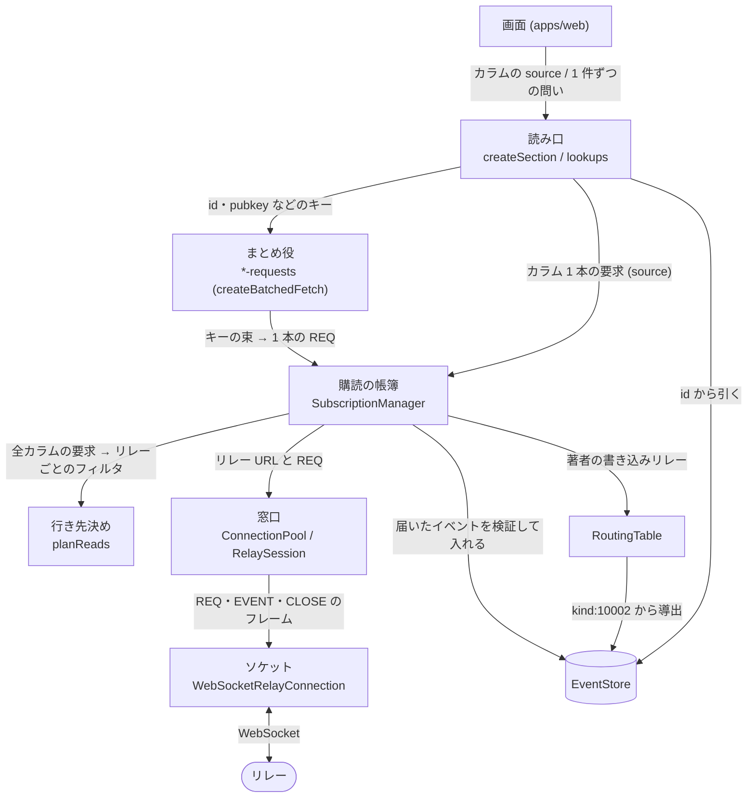

# @streets/core

Nostr の読み書きをするパッケージ。UI は持たない。画面は `apps/web` にあり、ここだけを参照する。

このページは、読み取り層（`src/read/` と `src/relay/`）を初めて読む人が 10 分で掴むためのもの。用語は [CONTEXT.md](../../CONTEXT.md)、後から戻しにくい決定は [docs/adr/](../../docs/adr/)。

## 読み取り層の段

画面が「この人の投稿がほしい」と言ってから、リレーへ REQ が飛ぶまでの段を、上から下に並べる。矢印の文字は、段の間で渡すもの。

`createReadLayer`（`read/read-layer.ts`）が全部を組み立てる。`EventStore` を作るのはここだけで、アプリは `ReadLayer` を 1 つ持つ。

段の間の import の向きは、図のとおりに上から下へだけ許す。lint の規則 `streets/read-layers`（`scripts/read-layers.mjs`）が、import を書いたその場で確かめる。`read/` と `relay/` に新しいファイルを足したら、この表に段を書き足さないと落ちる。

## 段ごとの約束

### 読み口

- ファイル：`solid/create-section.ts`（`createSection`）、`read/section-reader.ts`、`read/lookups.ts`
- 受け取るもの：カラム 1 本の `source`（何をどの順で取るか）。または 1 件ずつの問い（プロフィール・投稿・反応の数・フォロー一覧）。
- 返すもの：並んだ投稿とその取得の状態（取得中・完了・取り足せるか）。1 件ずつの問いには、取得中・あった・無かったのどれか。
- 知らないこと：リレー、REQ、窓の長さ。`SectionReader` は id の並びと状態だけを持ち、本体は `EventStore` から引く。

### まとめ役

- ファイル：`read/batched-fetch.ts`（`createBatchedFetch`）と、それを設定として使う `*-requests.ts`
- 受け取るもの：キー（id・pubkey・アドレス）。種類ごとの設定は「キーの識別子」「キーの束から作るフィルタ」「取れたことの印」。
- 返すもの：窓の間にためたキーを 1 本の `fetchOnce` にして渡す。終わったら購読者へ「何か片付いた」とだけ知らせる。
- 知らないこと：行き先のリレー。手元にあるかの判定と取り直しの間隔も、種類ごとの設定の側にあり、ここへは寄せない。窓の長さは各ファイルの `*_BATCH_MS`。

### 行き先決め

- ファイル：`read/read-planner.ts`（`planReads`）、`read/relay-selector.ts`、`read/query-plan.ts`、`read/read-plan.ts`、`read/read-routing.ts`
- 受け取るもの：全カラムの要求と、環境（著者ごとの書き込みリレー、開いているリレー、止めているリレー、接続の予算 `MAX_CONNECTIONS`、1 人あたりの本数 `RELAY_REDUNDANCY`）。
- 返すもの：リレーごとのフィルタ、行き先が分からなかった著者、予算で漏れた著者、画面に見せる `ReadPlan`。
- 知らないこと：時間と接続。純粋な関数で、前回の結果も覚えない。差分を当てるのは帳簿の仕事。

### 購読の帳簿

- ファイル：`read/subscription-manager.ts`（`SubscriptionManager`）、`read/collect.ts`、`read/older-page.ts`、`read/newer-page.ts`
- 受け取るもの：カラムの購読の出入り、`fetchOnce` の要求、ルーティング表の変化。
- 返すもの：カラムへ、届いた id・リレーごとの完了と不達・計画の変化。`planReads` の結果は前回との差分だけを窓口へ当てる（張る・閉じる・担当の著者が変わったら張り直す）。休止から戻ったときの取り足し、古い・新しい投稿のページ取り、`fetchOnce` の期限（`FETCH_ONCE_SOFT_TIMEOUT_MS` ほか）もここで持つ。
- 知らないこと：どう選ぶか（`planReads` の中身）と、接続の細部（枠・待ち行列・繋ぎ直し）。

### 窓口

- ファイル：`read/connection-pool.ts`（`ConnectionPool`）、`read/relay-session.ts`（`RelaySession`）
- 受け取るもの：リレー URL と、REQ・publish の要求。
- 返すもの：購読のハンドル（閉じる口）と、リレーごとの状態。`ConnectionPool` は URL → `RelaySession` の表で、同時に開く本数の予算 `MAX_CONNECTIONS` を守る。`RelaySession` はリレー 1 本ぶんの繋ぎ直し、使われなくなってからの猶予（`IDLE_LINGER_MS`）、同時購読の枠（`DEFAULT_MAX_SUBSCRIPTIONS` と NIP-11 の値）と待ち行列、NOTICE / CLOSED の断りの学習、認証のやり直しの指示を持つ。
- 知らないこと：Outbox。なぜそのリレーを開くのか、どの著者のためかは知らない。書き込み（`write/`）も同じ窓口を通る。

### ソケット

- ファイル：`relay/websocket-relay-connection.ts`（`RelayConnection` の実装）、型は `relay/relay-connection.ts`
- 受け取るもの：REQ・CLOSE・EVENT の送信。
- 持つもの：NIP-42 の AUTH への応答（署名は署名者に頼む）。
- 返すもの：EVENT・EOSE・CLOSED・NOTICE を、購読ごとのコールバックへ。
- 知らないこと：上の段のすべて。繋ぎ直しの方針も持たない（窓口が決める）。テストでは `relay/fake-relay-connection.ts` に差し替える。

### 脇

- `read/event-store.ts`（`EventStore`）：署名の検証（`signature-gate.ts`）、同じイベントのまとめ、置換可能イベントの最新版、削除依頼、端末への保存（`event-persistence.ts` の口と `indexeddb-persistence.ts`）。どのリレーで見たかも覚える（`seen-relays.ts`）。リレーも購読も知らない。
- `read/routing-table.ts`（`RoutingTable`）：`EventStore` の kind:10002 から、著者ごとの書き込みリレー・読み込みリレーを引く。表は自前で覚えず、毎回ストアから導く。
- `read/bootstrap.ts`（`warmUpRouting`）：起動時に、インデクサ（`BOOTSTRAP_INDEXERS`）から自分のフォロー一覧と、フォロー先の kind:10002 を先に取る。
- `read/scheduler.ts`：タイマーと時刻の差し替え口。どの段にも属さず、どの段からも読める。

## 例：Outbox で 1 人の投稿が読まれるまで

フォロー中の Alice（`alice`）の投稿を並べるカラムを 1 本開く。

1. カラムが `createSection` に、`authors: [alice]` の `source` を渡す（読み口）。`SectionReader` を作り、`SubscriptionManager.subscribe` を呼ぶ。
2. 帳簿は、開いている全カラムの要求を集め、`planReads` に渡す。環境として、`RoutingTable.writeRelaysFor(alice)` と、いま開いているリレー、止めているリレーも添える。
3. `planReads` は Alice の kind:10002 に書いてある書き込みリレーを候補にする。`relay-selector.ts` が、全カラムの著者を少ないリレーでまとめて覆うよう貪欲に選ぶ。同じ人を `RELAY_REDUNDANCY` 本から取り、予算 `MAX_CONNECTIONS` の中に収める。開くと決めたリレーのうち、Alice に割り当てる `RELAY_REDUNDANCY` 本は、kind:10002 に書かれた順ではなく、自分の読み込みリレー、既定のリレーや名指しのリレー、多くの人をまかなうリレーの順に選ぶ（書かれた順は、本人がいま使っているかと関係がない）。結果は「リレー → フィルタ（`authors` に Alice を含む）」。Alice の kind:10002 がまだ無いときは、行き先が分からない著者として数え、既定のリレー（`FALLBACK_RELAYS`）へ回す。
4. 帳簿は結果を前回と比べ、増えたリレーにだけ `ConnectionPool.subscribe` を呼ぶ。すでにそのリレーを別のカラムのために開いていれば、REQ のフィルタだけが変わる。
5. 窓口は URL から `RelaySession` を取り出す（無ければ作る）。同時購読の枠が埋まっていれば待ち行列に入れ、空いたら `WebSocketRelayConnection` に REQ を送らせる。
6. EVENT が戻ると、`RelaySession` を経て帳簿に届く。帳簿は `EventStore.put` で署名を検証し、重複をまとめて入れる。入った id だけを `SectionReader` へ渡す。
7. `SectionReader` は id を並べ、本体を `EventStore` から引く。窓（`NOTIFY_BATCH_MS`）の間にたまった変化を 1 回の通知にして、`createSection` の signal を更新する。画面が描き直される。
8. Alice が新しい kind:10002 を出すと、`EventStore` が置換可能イベントの最新版を差し替え、`ReadLayer` が `ROUTING_REPLAN_BATCH_MS` の窓でまとめて `replan()` を呼ぶ。手順 2 からやり直し、差分だけが窓口に当たる。

## 読み取り層以外

| ディレクトリ | 中身 |
| --- | --- |
| `nostr/` | イベントの型、組み立て（`build/`）、パース、NIP-19 |
| `write/` | 署名して publish する経路、リレーへの一斉送信 |
| `signer/` | NIP-07 / NIP-46 の署名者。秘密鍵を持たない |
| `deck/` | カラムの種類の表、カラムの取得元（`column-sources.ts`）、保存の形 |
| `view/` | 表示のための整形と集計 |
| `moderation/` | ミュートリストの解読と編集 |
| `lists/` | フォローセットの解読と編集 |
| `settings/` | 端末設定とリレーリストの状態 |
| `solid/` | `createSection` など、読み取り層を Solid の signal にする |
| `search/`・`signal/` | 検索語の解釈と、コマンドパレットの検索 |
| `media/` | 画像・動画のアップロードと圧縮 |
| `zap/` | Zap（LNURL・BOLT11・送金の流れ） |
| `emoji-maker/` | カスタム絵文字の画像づくり |
| `telemetry/` | 送る前の情報の除去 |
