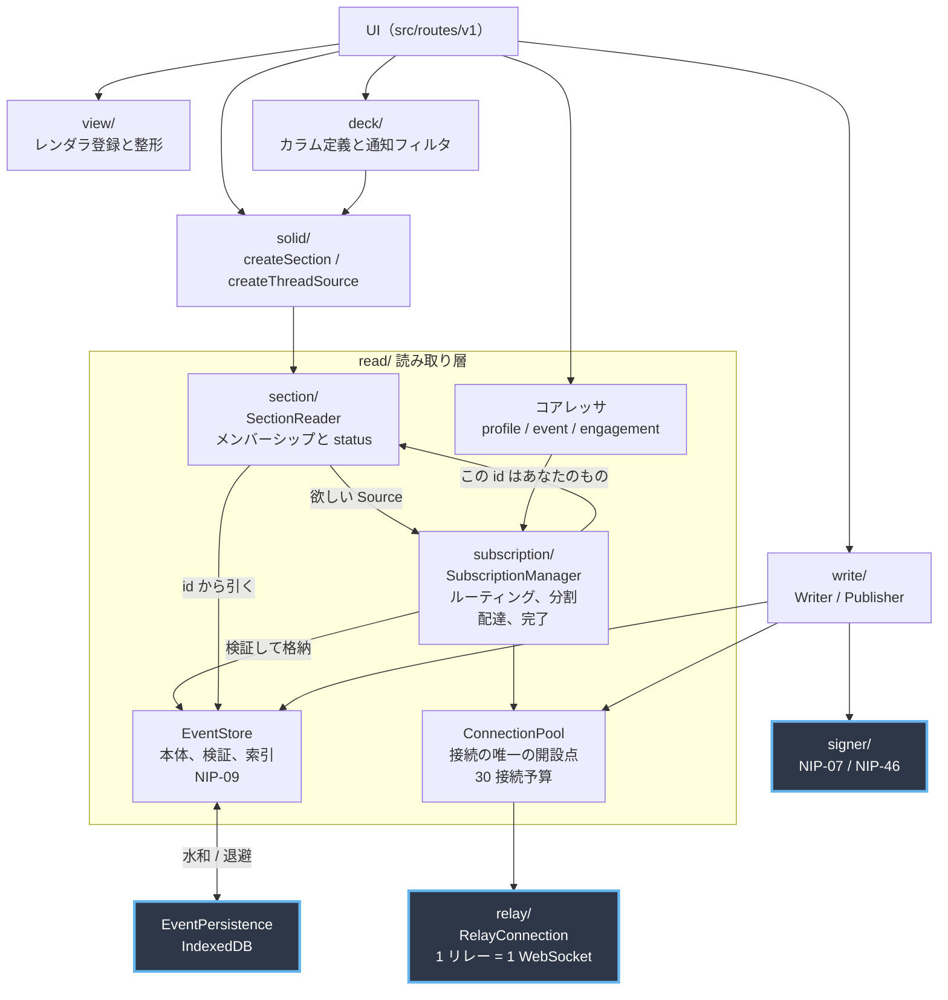
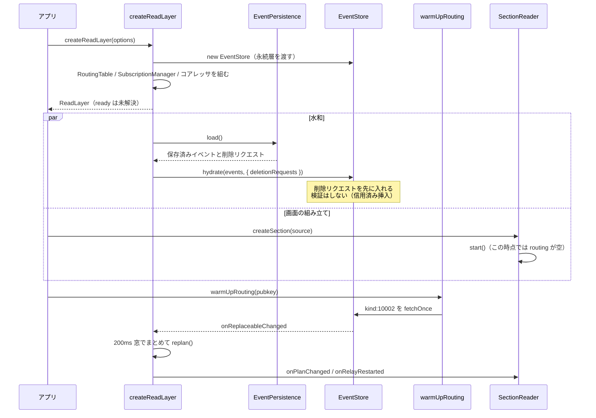

# src/core の地図

**この文書は「どこに何があるか」だけを書く。**
「なぜその形なのか」は [docs/design/architecture.md](../../docs/design/architecture.md)、個々の決定は [docs/adr/](../../docs/adr/)、実在するが直していない欠陥は [read-layer-followups.md](../../docs/design/read-layer-followups.md) にある。
用語は [CONTEXT.md](../../CONTEXT.md)。

## 最初に知っておくこと

**このディレクトリには v1 と v0（旧実装）が同居している。**
v1 だけを読みたいなら、下の表の「v0」の行を飛ばす。

同じ名前のファイルが 3 組ある。

| ファイル名 | v1 | v0 |
|---|---|---|
| `event-store.ts` | `read/event-store.ts` | `store/event-store.ts` |
| `reaction.ts` | `nostr/reaction.ts` | `nostr/build/reaction.ts` は v1 の組み立て側 |
| `relay-list.ts` | `read/relay-list.ts` | `nostr/relay-list.ts`（参照元なし） |

境界は `scripts/check-read-layer-deps.mjs` が機械的に検査している。
新旧が同じディレクトリに同居しているため、この検査はファイルを明示的に列挙している。

## 層

青枠が seam（差し替え可能な接合部）。
それ以外は読み取り層の内部で、外からは見えない。

**配達の向きに注意する。**
`SubscriptionManager` から `SectionReader` へ流れるのは「この id をあなたのメンバーシップに足せ」という通知であって、`EventStore` がカラムの中身を決めるのではない。

## ディレクトリ

| ディレクトリ | 版 | 役割 |
|---|---|---|
| `read/` | v1 | 読み取り層。接続、購読、store、セクション、コアレッサ |
| `write/` | v1 | 署名して publish する経路と楽観挿入の検証 |
| `signer/` | v1 | NIP-07 と NIP-46。秘密鍵はここにも入らない |
| `relay/` | v1 | 1 リレー分の WebSocket と NIP-11 |
| `nostr/` | v1 | イベントの組み立て（`build/`）、パース、NIP-19 |
| `deck/` | v1 | カラム定義、`Source` への解決、通知フィルタ、カラム警告 |
| `view/` | v1 | レンダラ登録、描画窓、集計、整形 |
| `moderation/` | v1 | NIP-51 ミュートリストの解読と変更 |
| `settings/` | v1 | 端末設定とリレーリストの状態 |
| `solid/` | 混在 | `create-*.ts` が v1、`use-*.ts` と `provider.tsx` が v0 |
| `store/` | **v0** | 旧 EventStore と FeedStateStore |
| `transport/` | **v0** | 旧 rx-nostr ラッパ |
| `query/` | **v0** | 旧 QueryClient と QueryRegistry |
| `repository/` | **v0** | 旧リポジトリ |

## read/ のファイル

22 ファイルあるが、役割は 5 つしかない。

### 接続と購読

| ファイル | 役割 |
|---|---|
| `connection-pool.ts` | URL から接続を引く唯一の場所。30 接続予算、指数バックオフ再接続、REQ の送信 |
| `subscription-manager.ts` | セクションの意図をリレー別のプランへ変換し、配達と完了を管理する |
| `relay-selector.ts` | 予算の下で著者を被覆するリレーを貪欲に選ぶ |
| `routing-table.ts` | pubkey からリレーを引く表（`kind:10002` 由来） |
| `query-plan.ts` | 著者集合をリレー別のフィルタへ分割し、送れなかった著者を数える |
| `relay-list.ts` | `kind:10002` のパース |
| `default-relays.ts` | fallback リレー |
| `bootstrap.ts` | 起動時のルーティング解決（`warmUpRouting`） |
| `collect.ts` | 一度引いて閉じる購読（`fetchOnce` の中身） |
| `filter-match.ts` | NIP-01 のフィルタ意味論を自前で実装した純粋関数。依存ゼロ |

### store と永続化

| ファイル | 役割 |
|---|---|
| `event-store.ts` | id から検証済みイベント。置換可能索引、タグ索引、NIP-09 の削除 |
| `event-persistence.ts` | 永続層の interface（seam） |
| `indexeddb-persistence.ts` | その IndexedDB 実装 |
| `cache-policy.ts` | kind ごとの `staleMs` / `retention` / `scope` |

### セクション（カラム 1 本）

| ファイル | 役割 |
|---|---|
| `section-reader.ts` | 1 カラムのメンバーシップと `status` |
| `sorted-events.ts` | 全順序を保つ配列。二分探索で挿入し、上限超過で末尾を捨てる |
| `source.ts` | `Source` / `Order` / `SectionStatus` の型と 200 件上限 |

### コアレッサ（N+1 を畳む）

| ファイル | 役割 |
|---|---|
| `profile-requests.ts` | `kind:0` を 200ms 窓で 1 本の REQ にまとめる |
| `event-requests.ts` | id 指定のイベントを窓でまとめる |
| `engagement-requests.ts` | リアクションとリポストをまとめる |

### その他

| ファイル | 役割 |
|---|---|
| `read-layer.ts` | 合成ルート。`EventStore` はここでしか `new` されない |
| `fake-clock.ts` | テスト用の決定的な時刻 |

## 起動の流れ

**`ready` は失敗しない。**
永続層が壊れていても resolve する。

**`kind:10002` の到着で自動的に `replan()` は走らない。**
呼ぶのは水和や再ウォームアップなど明示的な入口だけである（[ADR-0016](../../docs/adr/0016-routing-bootstrap.md)）。

## 1 イベントが届いてから表示されるまで

[architecture.md の 5 節](../../docs/design/architecture.md)にシーケンス図がある。
照合と検証の順序、重複の扱い、通知のバッチはそこを見る。

## 読む順番

初めて読むなら、この順で 5 ファイルだけ読めば骨格が分かる。

1. `read/source.ts`。呼び出し側が渡すものと受け取るもの
2. `read/read-layer.ts`。何と何が組み合わさっているか
3. `read/section-reader.ts`。カラム 1 本の全体
4. `read/event-store.ts` の `put()`。照合と検証と削除の順序
5. `read/subscription-manager.ts` の `SectionPlan` 型。購読層が扱う値の形

`connection-pool.ts` と `subscription-manager.ts` は行数が多いが、半分近くはコメントである。
先に上の 5 つを読むと、残りは差分として読める。
